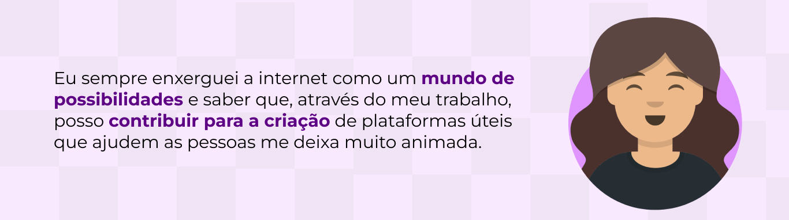
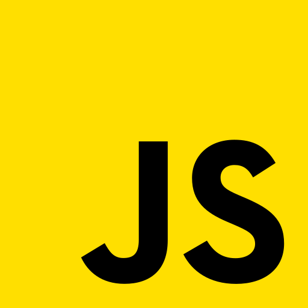

<h1 align="center">Oii, eu sou a Mariana Gonçalves</h1>
<h3 align="center">Desenvolvedora frontend</h3>
 

 
  

<h3 align="left">Tecnologias:</h3>

 
    
    
    
    
    
    
    
     
    
</>

<h3 align="left">Redes sociais:</h3>

    
    

